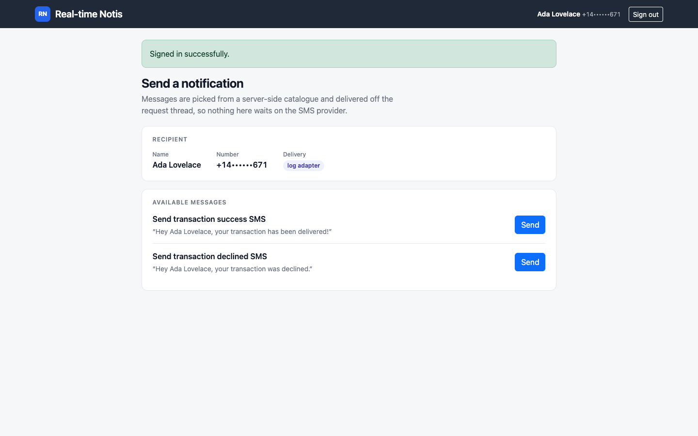
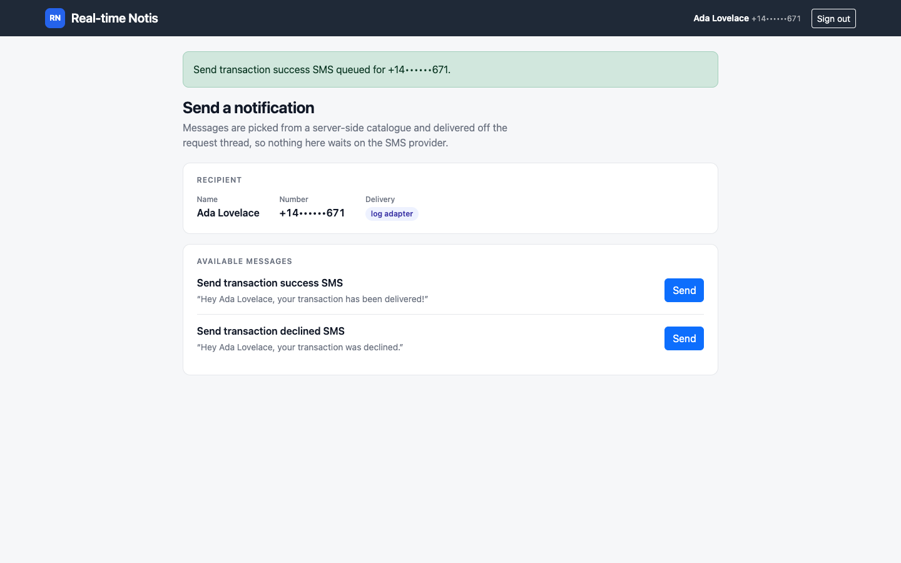
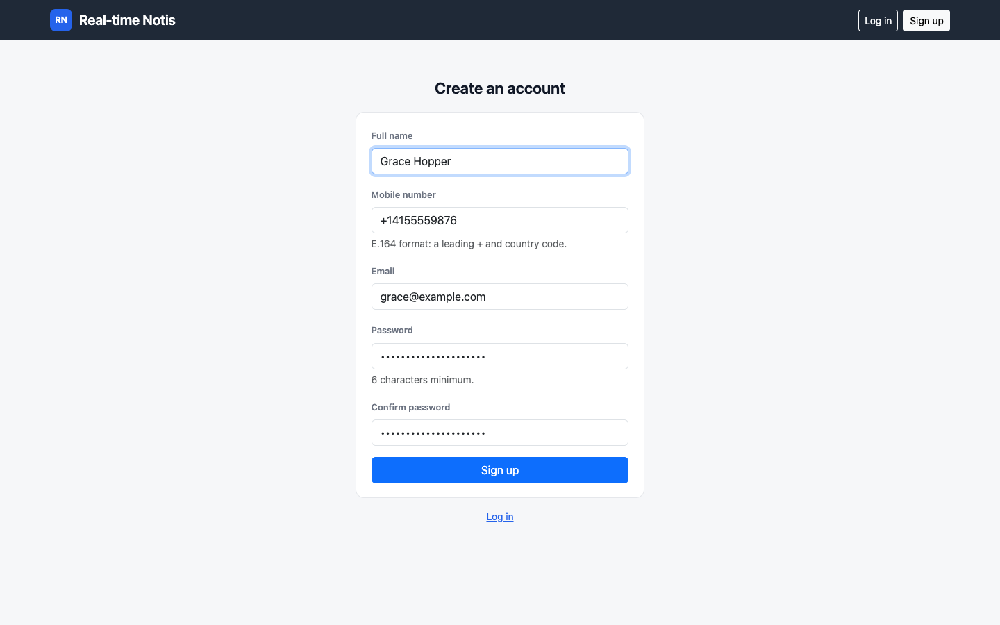
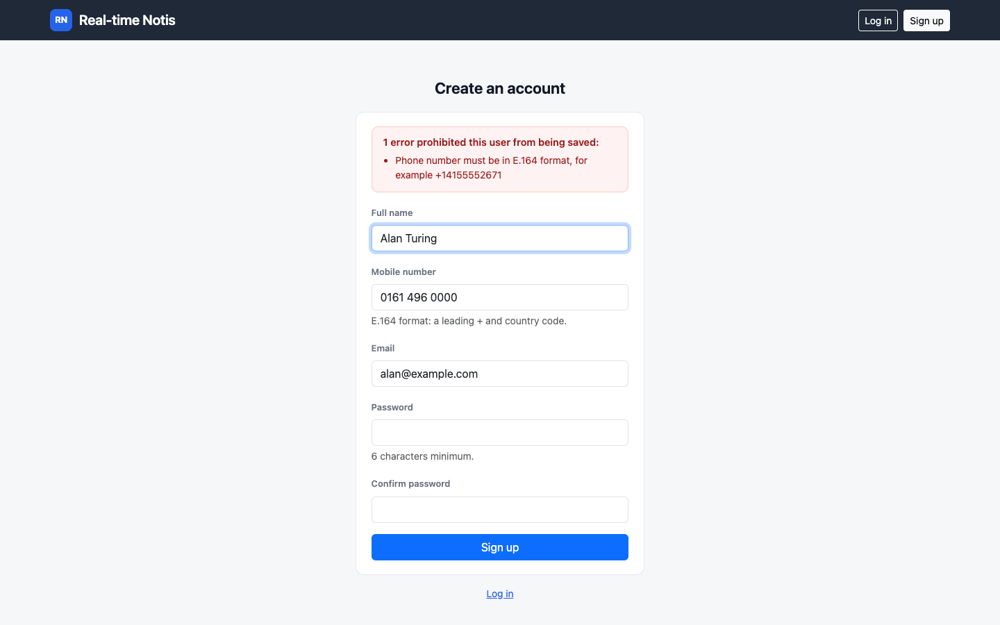
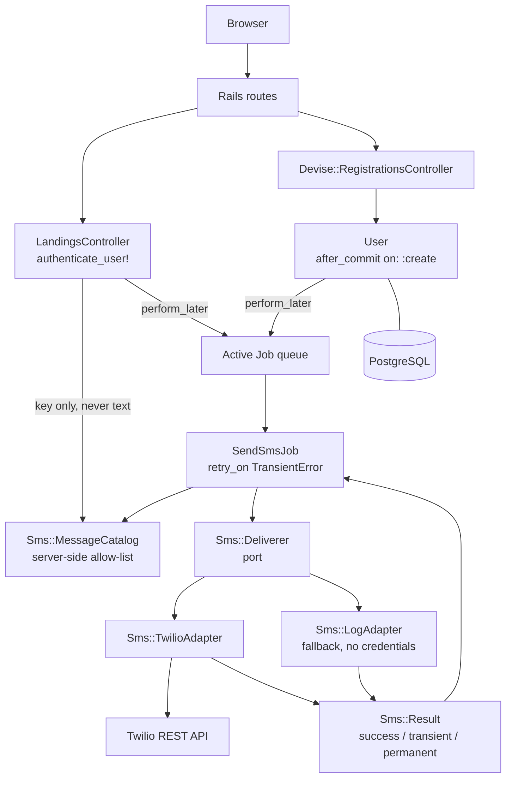
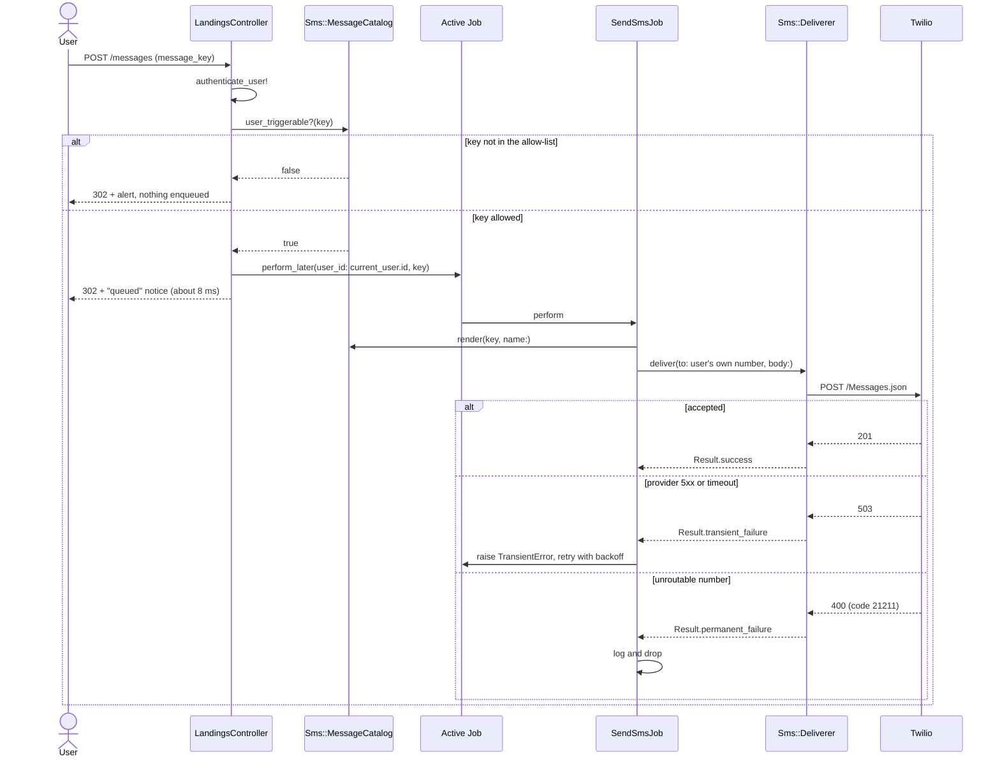

# Real-time Notis

A small Rails application that sends transactional SMS to the signed-in
user. People register with a phone number, get a welcome text, and can
trigger one of a fixed set of messages from their dashboard. Twilio is the
delivery provider; with no Twilio credentials configured the app falls back
to a log adapter, so it runs end to end on a laptop without an account.

Despite the name, there is **no WebSocket or Action Cable layer here** —
"real-time" means a text message goes out the moment an event happens. The
generated `ApplicationCable` classes are stock Rails scaffolding and are
not used. See [Limitations](#limitations).

## Screenshots

Captured with Playwright at 1440×900 against a local server on port 8860,
signed in as the seeded demo user.

| Dashboard | Message queued |
| --- | --- |
|  |  |

| Sign-up | Validation error |
| --- | --- |
|  |  |

Real request/response transcripts, the latency measurement and the test
output are in [docs/captured-output.md](docs/captured-output.md).

## Architecture

The SMS side is **ports and adapters**. Callers depend on `Sms::Deliverer`,
never on Twilio; adapters are registered by name and chosen at call time.



Two rules hold the design together:

- **No web request ever calls the SMS provider.** Controllers and model
  callbacks enqueue; only `SendSmsJob` talks to an adapter.
- **No caller ever supplies message text.** A key is looked up in
  `Sms::MessageCatalog`, which also decides whether a user may trigger it.

## Sending a message



## Quickstart

Requires Ruby 3.2.2 and PostgreSQL. No Twilio account needed.

```bash
bundle install
bin/rails db:prepare db:seed
bin/rails server
```

Open <http://localhost:3000> and sign in as `demo@example.com` /
`correct horse battery`, or register a new account. With no `TWILIO_*`
variables set, messages are written to `log/development.log` rather than
sent:

```
[sms:log] to=+14••••••671 body="Hey Ada Lovelace, your transaction has been delivered!"
```

To send real messages, set the three `TWILIO_*` variables below.

With Docker:

```bash
docker compose up --build   # http://localhost:8860
```

## Configuration

Every variable is optional. The app boots and works with none of them set.

| Name | Required | Default | Purpose |
| --- | --- | --- | --- |
| `DATABASE_URL` | No | from `config/database.yml` | PostgreSQL connection. Overrides the YAML when set. |
| `TWILIO_ACCOUNT_SID` | For real SMS | credentials `twilio.account_sid` | Twilio account SID. |
| `TWILIO_AUTH_TOKEN` | For real SMS | credentials `twilio.auth_token` | Twilio auth token. |
| `TWILIO_FROM_NUMBER` | For real SMS | credentials `twilio.from_number` | Sending number, E.164. Was hard-coded in the source before. |
| `SMS_ADAPTER` | No | `twilio` if all three above are set, else `log` | Forces an adapter by name. |
| `QUEUE_ADAPTER` | No | `async` | Active Job backend. `async` is in-process; use a durable one in production. |
| `RAILS_MASTER_KEY` | Production only | — | Decrypts `config/credentials.yml.enc`. Not needed if you use the `TWILIO_*` variables. |
| `SECRET_KEY_BASE` | Production only | — | Session and cookie signing. Required if `RAILS_MASTER_KEY` is absent. |
| `DEVISE_SECRET_KEY` | No | `secret_key_base` | Overrides Devise's token secret. |
| `DEVISE_PEPPER` | No | none | Password pepper. Changing it invalidates existing passwords. |
| `MAILER_SENDER` | No | `no-reply@example.com` | `From:` on Devise emails. |
| `SEED_EMAIL` / `SEED_NAME` / `SEED_PHONE` / `SEED_PASSWORD` | No | demo values | Overrides for `db:seed`. |
| `WEB_PORT` | No | `8860` | Host port in `docker-compose.yml`. |
| `POSTGRES_PASSWORD` | Compose only | `development-only` | Password for the compose `db` service. |

## Development

```bash
bundle exec rspec       # test suite (57 examples)
bundle exec rubocop     # linting, rubocop-rails-omakase
bin/rails db:seed       # idempotent demo account
```

The suite needs PostgreSQL but nothing else: Active Job uses the `:test`
adapter, the SMS layer is pinned to the log adapter in `config/environments/test.rb`,
and WebMock blocks every outbound connection. **No spec can reach the
network.** Before that was true, creating a user in a spec made a live
request to `api.twilio.com`.

## Project structure

```
app/
  controllers/
    landings_controller.rb      # the one signed-in screen; enqueues, never delivers
  jobs/
    send_sms_job.rb             # the only place that talks to an adapter
  models/
    user.rb                     # E.164 validation; after_commit enqueues the welcome SMS
  services/sms/
    deliverer.rb                # the port: named adapter registry
    message_catalog.rb          # every sendable message + who may trigger it
    twilio_adapter.rb           # Twilio REST, classifies failures
    log_adapter.rb              # credential-free fallback, masks numbers
    result.rb                   # success / transient / permanent value object
    transient_error.rb          # the signal that drives Active Job retries
  views/
    landings/, devise/, shared/ # server-rendered ERB, Bootstrap 5
config/
  initializers/sms.rb           # registers the adapters, picks the default
db/
  migrate/, schema.rb, seeds.rb
docs/
  captured-output.md            # real transcripts and measurements
  screenshots/
spec/
  requests/                     # authentication, authorisation, the allow-list
  jobs/, services/, models/, controllers/
```

## Design notes

**Delivery is asynchronous, and that is the main change from the original
design.** The welcome SMS used to be an `after_create` callback that called
Twilio inline and, on failure, added an error and raised
`ActiveRecord::Rollback`. Three things were wrong with that. A third-party
outage silently discarded a valid sign-up. The HTTP call happened inside
the database transaction, holding a connection open for the round trip.
And because `ActiveRecord::Rollback` is swallowed by the transaction,
`User.create!` returned an unpersisted record *without raising* — a bang
method that does not bang. It is now `after_commit on: :create` enqueuing a
job, so the row is committed before anything reaches out, and retries are
Active Job's problem.

**The bottleneck was the synchronous provider call, not the database.** One
table, two indexes, no association to N+1 — there is no query problem to
solve here. Measured with a provider made to take 1.5 s: `POST /messages`
went from ≈1.52 s to ≈8 ms on the request thread
([numbers](docs/captured-output.md#2-request-latency-when-the-provider-is-slow)).
On Puma's default five threads, the inline version saturated at roughly
three requests per second during a provider slowdown.

**Messages are an allow-list, not free text.** The controller used to pass
`params[:msg]` straight to Twilio, so any signed-in user could send
arbitrary text at the operator's expense — an SMS relay with a login form
in front of it. Callers now pass a catalogue key; `Sms::MessageCatalog`
owns the bodies and marks `:welcome` as system-only. The recipient is
always `current_user.phone_number`; a `user_id` or `phone_number` in params
is ignored, and there are request specs asserting exactly that.

**The adapter registry is the extension seam.** Adding a second provider is
one class and one `Sms::Deliverer.register` call — no caller changes:

```ruby
Sms::Deliverer.register("vonage") { Sms::VonageAdapter.new }
# SMS_ADAPTER=vonage bin/rails server
```

The `log` adapter exists for the same reason: it lets the application boot,
register users and exercise both buttons with no provider account, which is
also what makes the screenshots above reproducible.

**Failures are values, not exceptions.** Adapters return `Sms::Result` and
classify the failure — a provider 5xx or a connection reset is retryable, a
rejected number is not. Only the job turns a retryable result into an
exception, because that is the only layer where raising means something.

**Phone numbers are masked wherever they are displayed or logged.**
`+14155552671` renders as `+14••••••671` in the UI, in flash messages and
in log lines.

**`json` is pinned to the 2.x line.** Rails 7.1's `ActiveSupport::JSON::Encoding`
calls `JSON.generate(..., quirks_mode: true)`, a keyword removed in json 3.
Nothing in the app requires `json` directly, but RuboCop depends on
`json >= 2.3`, so adding the linter was enough to resolve json 3 and make
every request raise `ArgumentError: unknown keyword: quirks_mode`. The pin
is deliberate; the comment in the `Gemfile` explains it.

## Limitations

- **There is no WebSocket, Action Cable or browser push.** The name is
  historical. `app/channels/` holds unmodified generated scaffolding.
- **No delivery confirmation in the UI.** The dashboard says a message was
  *queued*, not delivered. Twilio status callbacks are not implemented, so
  there is no record of what actually arrived.
- **`QUEUE_ADAPTER=async` loses queued messages on restart.** It is an
  in-process thread pool with no persistence. Point it at a durable backend
  before anyone relies on delivery.
- **No rate limiting.** A signed-in user can press Send as often as they
  like. The allow-list caps *what* can be sent, not how often; a real
  deployment needs a per-user throttle.
- **No delivery record.** Nothing is written to the database when a message
  is sent, so there is no history, no audit trail and no idempotency key —
  a retried job sends the message again.
- **`config/credentials.yml.enc` is committed without its master key**, so
  it cannot be decrypted. The `TWILIO_*` environment variables exist partly
  because of this.
- **Phone numbers are never verified.** Anyone can register with anyone
  else's number and cause a text to be sent to it.
- **One dashboard, two messages.** The catalogue is a constant; changing
  the messages means a deploy.
