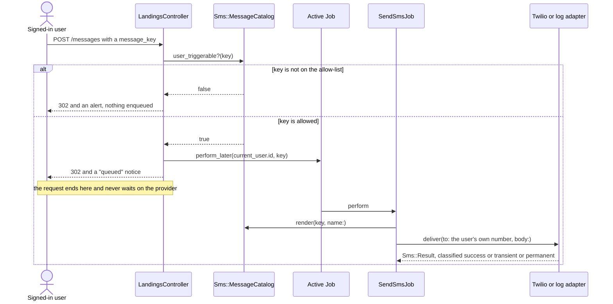
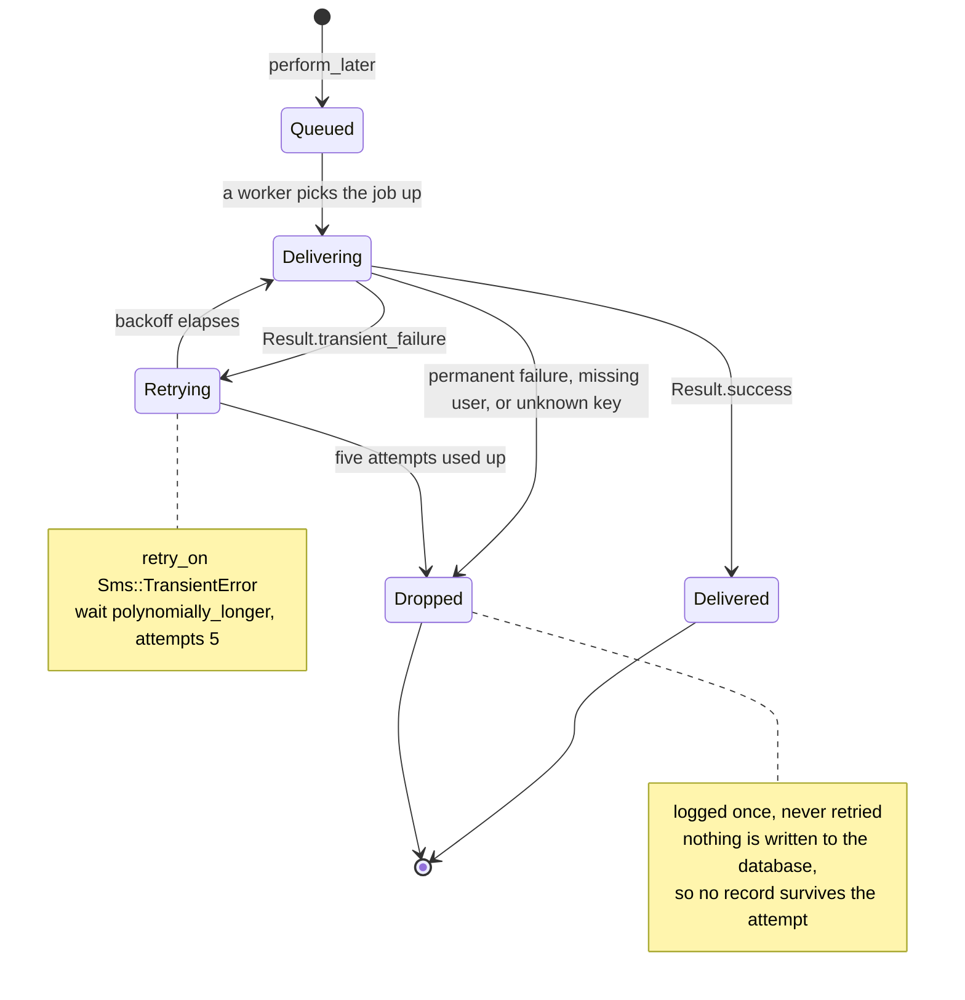

# Real-time Notis

A small Rails 7.1 app that sends transactional SMS to the signed-in user.
People register with a phone number, get a welcome text, and can trigger one
of a fixed set of messages from a single dashboard. Twilio delivers them —
but with no Twilio credentials configured the app falls back to a log
adapter, so the whole thing runs end to end on a laptop with no account and
no spend.

**A note on the name.** There is no WebSocket, Action Cable or browser-push
layer in this repository. `app/channels/` holds the two unmodified classes
`rails new` generates and `config/cable.yml` is stock. "Real-time" here means
a text message goes out the moment an event happens, not that the browser
gets pushed to. If you came looking for a broadcast pipeline, it is not here.

## The one screen

Everything a signed-in user can do fits on one page: see which number the
message will go to, and press one of two buttons. The "log adapter" pill is
the app telling you no Twilio credentials are configured.

| Dashboard | After pressing Send |
| --- | --- |
|  |  |

Sign-up takes a name and an E.164 number, and rejects anything else before a
row is written:

| Sign-up | Rejected number |
| --- | --- |
|  |  |

All four were captured at 1440×900 against the app running locally on the log
adapter. Request transcripts, the latency measurement and the test output are
in [docs/captured-output.md](docs/captured-output.md).

## From button press to text message

The interesting part is what the request does *not* do: it never talks to
Twilio. The controller checks the key against a catalogue, enqueues a job and
returns. A worker does the delivery.



Sign-up takes the same path from a different entry point: `User` has
`after_commit on: :create`, so the welcome SMS is enqueued only once the row
is durably committed.

## Running it without a Twilio account

Requires Ruby 3.2.2 and PostgreSQL.

```bash
bundle install
bin/rails db:prepare db:seed
bin/rails server
```

Open <http://localhost:3000> and sign in as `demo@example.com` /
`correct horse battery`, or register a new account. With no `TWILIO_*`
variables set, messages land in `log/development.log` instead of a phone:

```
[sms:log] to=+14••••••671 body="Hey Ada Lovelace, your transaction has been delivered!"
```

Set the three `TWILIO_*` variables to send for real. With Docker:

```bash
docker compose up --build   # http://localhost:8860
```

The compose file and `Dockerfile` are committed and `docker compose config`
parses, but the image has not been built or booted here — treat it as
unverified.

## When the provider is slow or down

Adapters do not raise on a delivery failure. They return an `Sms::Result`
that classifies it, and `SendSmsJob` decides what that classification means:
a provider 5xx or a connection reset is worth another go, an unroutable
number never will be.



Because none of this happens on the request thread, a provider slowdown costs
the user nothing. A measurement committed in
[docs/captured-output.md](docs/captured-output.md#2-request-latency-when-the-provider-is-slow)
puts a deliberate 1.5 s delay in the adapter and compares the two shapes:
delivering inline makes `POST /messages` take ≈1.52 s, enqueueing makes it
≈8 ms. On Puma's default five threads the inline shape saturates at roughly
three requests per second while the provider is slow.

Two specs pin the behaviour that matters here: `spec/requests/registrations_spec.rb`
*"still creates the account when the SMS provider is down"*, and
`spec/controllers/landings_controller_spec.rb` *"does not deliver inline"*.

## Two rules the code keeps

**No web request ever calls the SMS provider.** Controllers and model
callbacks enqueue. `SendSmsJob` is the only thing that touches an adapter.
This is what stops a Twilio outage from rolling back a valid sign-up or
turning into a 500.

**No caller ever supplies message text.** `Sms::MessageCatalog` owns all
three bodies and decides who may trigger each one — `:welcome` is marked
system-only, so it cannot be replayed from the browser. The recipient is
always `current_user.phone_number`; a `user_id` or `phone_number` in params
is ignored, and `spec/requests/messages_spec.rb` asserts exactly that. Without
this, a signed-in user could send arbitrary text at the operator's expense.

Adding a second provider is one class and one line, with no caller changes:

```ruby
Sms::Deliverer.register("vonage") { Sms::VonageAdapter.new }
# SMS_ADAPTER=vonage bin/rails server
```

Phone numbers are masked wherever they are shown or logged — `+14155552671`
renders as `+14••••••671` in the UI, in flash messages and in log lines.

## Environment variables

Every one is optional. The app boots and works with none of them set.

| Name | Required | Default | Purpose |
| --- | --- | --- | --- |
| `DATABASE_URL` | No | from `config/database.yml` | PostgreSQL connection. Overrides the YAML when set. |
| `TWILIO_ACCOUNT_SID` | For real SMS | credentials `twilio.account_sid` | Twilio account SID. |
| `TWILIO_AUTH_TOKEN` | For real SMS | credentials `twilio.auth_token` | Twilio auth token. |
| `TWILIO_FROM_NUMBER` | For real SMS | credentials `twilio.from_number` | Sending number, E.164. |
| `SMS_ADAPTER` | No | `twilio` if all three above are set, else `log` | Forces an adapter by name. |
| `QUEUE_ADAPTER` | No | `async` | Active Job backend. `async` is in-process — use a durable one in production. |
| `RAILS_MASTER_KEY` | Production only | — | Decrypts `config/credentials.yml.enc`. Not needed if you use the `TWILIO_*` variables. |
| `SECRET_KEY_BASE` | Production only | — | Session and cookie signing. Required if `RAILS_MASTER_KEY` is absent. |
| `DEVISE_SECRET_KEY` | No | `secret_key_base` | Overrides Devise's token secret. |
| `DEVISE_PEPPER` | No | none | Password pepper. Changing it invalidates existing passwords. |
| `MAILER_SENDER` | No | `no-reply@example.com` | `From:` on Devise emails. |
| `SEED_EMAIL` / `SEED_NAME` / `SEED_PHONE` / `SEED_PASSWORD` | No | demo values | Overrides for `db:seed`. |
| `WEB_PORT` | No | `8860` | Host port in `docker-compose.yml`. |
| `POSTGRES_PASSWORD` | Compose only | `development-only` | Password for the compose `db` service. |

## Working on the code

```bash
bundle exec rspec       # 57 examples
bundle exec rubocop     # rubocop-rails-omakase
bin/rails db:seed       # idempotent demo account
```

The suite needs PostgreSQL and nothing else. Active Job runs on the `:test`
adapter, `config/environments/test.rb` pins the SMS layer to the log adapter,
and WebMock's `disable_net_connect!` blocks every outbound connection — **no
spec can reach the network**, which matters for a codebase whose whole job is
calling a paid third-party API.

The SMS layer lives in `app/services/sms/`: `deliverer.rb` is the port and
the named adapter registry, `message_catalog.rb` holds every sendable message
and who may trigger it, `twilio_adapter.rb` and `log_adapter.rb` are the two
implementations, and `result.rb` is the value object they return.
`app/jobs/send_sms_job.rb` is the only caller of an adapter. `test/` is a
vestigial Minitest tree that runs zero tests — RSpec is the real suite.

`json` is pinned to the 2.x line in the `Gemfile`, with a comment explaining
why: Rails 7.1's `ActiveSupport::JSON::Encoding` calls
`JSON.generate(..., quirks_mode: true)`, a keyword json 3 removed, and
RuboCop's `json >= 2.3` dependency is enough to resolve json 3 without the pin.

## What this does not do

- **No WebSocket, Action Cable or browser push**, despite the name.
- **No delivery confirmation.** The dashboard says *queued*, not delivered.
  Twilio status callbacks are not implemented.
- **No delivery record at all.** Nothing is written to the database when a
  message is sent, so there is no history, no audit trail and no idempotency
  key — a retried job sends the message a second time.
- **`QUEUE_ADAPTER=async` loses queued messages on restart.** It is an
  in-process thread pool with no persistence.
- **No rate limiting.** The allow-list caps *what* can be sent, not how
  often. A real deployment needs a per-user throttle.
- **Phone numbers are never verified.** Anyone can register with someone
  else's number and cause a text to be sent to it.
- **`config/credentials.yml.enc` is committed without its master key**, so it
  cannot be decrypted. The `TWILIO_*` variables exist partly because of that.
- **One dashboard, two messages.** The catalogue is a frozen constant, so
  changing the copy means a deploy.
